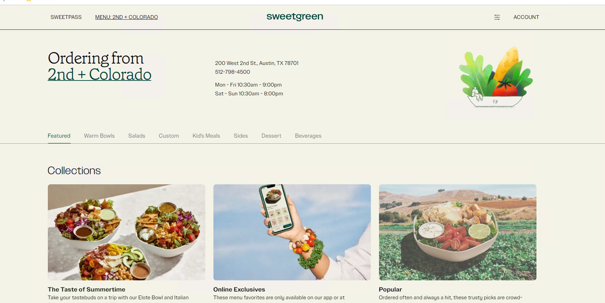

# 🌽 Sweetgreen - Restaurant Web Scraping Project 🥦

This tasty, healthy, Python-based project employs Selenium to relentlessly scrape and gather mind-blowing amounts of information about our favourite restaurant, Sweetgreen. 🥗🍏🍇

## Technological Ingredients Behind the Code-Coction 💻🔍

**Web Scraping:** It's kind of like a magic trick where vast amounts of data vanish from their original websites and reappear in a neat local file on your system. Ta-da! 🎉📁

**Python:** This general-purpose language is our dish for the day! Python is the perfect condiment you need to spice up any project- from web development to data science and system scripting. 🐍🔥

**Selenium:** Meet Selenium - the brave knight in shining armor, bolting across the web kingdom, automating the heck out of any website it finds! ⚔️🌐

**Anti-bot systems & CAPTCHA:** Kind of like puzzles you solve to win your gold medal. But worry not, we thrash and dash through anti-bot systems and CAPTCHAs alike, ensuring a smooth scraping experience. 🧩🏅

## Let's Get Scrappin'! 🎮

Kick off your journey with Sweetgreen. With our scraper, you can explore menus, analyze reviews, find ratings, and much more.

**More instructions here...**

## Contribute & Collaborate 🤝

Got suggestions, issues, or feature requests? We're all ears! (and eyes, for that matter). Feel free to explore our [issues page](<Your Issues Page Link>).

## Time to Scrape-away to Glory! Bon Appétit! 😁🍽️

---

## ©️2022 Your Name & The Web Scraping Team 🧑‍💻🎊

---
